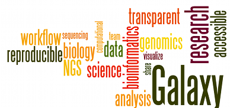

## Course Description
This course provides a practical introduction to Galaxy for the complete novice. Participants are lead through core aspects of Galaxy with a focus on analysis of RNA-seq data, using a case study.

## Course Objectives

After this course you should be able to:

* Perform QC of RNA-seq data (fastq, BAM and count files)
* Perform a differential expression analysis
* Create workflows for analysis of RNA-seq data in Galaxy
* Know what tools are available for RNA-seq analysis in Galaxy

## Topics Covered

### Week 1
- Introduction to Galaxy

### Week 2
- RNA-Seq (FASTQs to counts)

### Week 3
- RNA-Seq (differential expression)

### Week 4
- Recap/Q&A/Other tools

## Course Materials

### Week 1
- [Introduction to Galaxy](http://galaxyproject.github.io/training-material/topics/introduction/tutorials/galaxy-intro-peaks2genes/tutorial.html)

### Week 2
- [RNA-Seq (FASTQs to counts)](https://galaxyproject.github.io/training-material/topics/transcriptomics/tutorials/limma-voom_fastqs_to_counts/tutorial.html)

### Week 3
- [RNA-Seq (differential expression)](https://galaxyproject.github.io/training-material/topics/transcriptomics/tutorials/limma-voom/tutorial.html)

### Week 4
- Recap/Q&A/Other tools

## Course Presenters/Helpers

- Maria Doyle, Research Computing Facility
- Richard Lupat, Bioinformatics Core

## Acknowledgements
This course is run by the Peter Mac Data Science Training team and uses material from the [Galaxy Training Network](https://galaxyproject.org/teach/gtn/)

## Useful Resources
+ [Galaxy Europe](https://usegalaxy.eu/)
+ [Galaxy Training](https://galaxyproject.github.io/training-material/)
+ [Galaxy Biostars](https://biostar.usegalaxy.org/)
